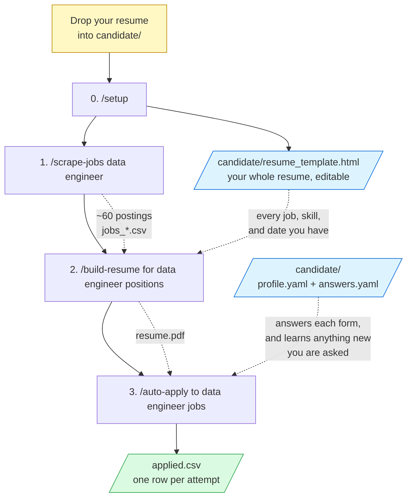
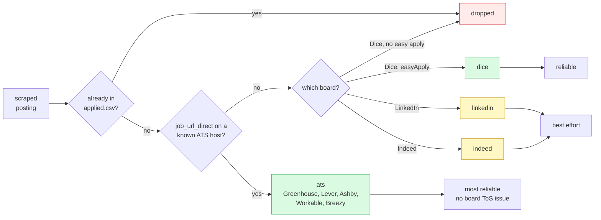
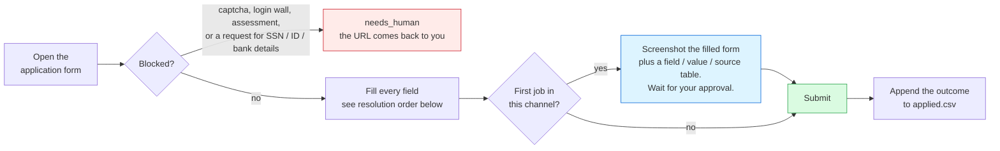
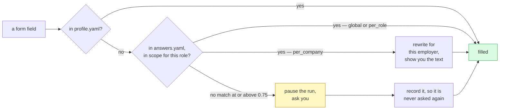

# job-bot

A three-step job-hunting pipeline for **one candidate**: scrape postings for a role, build a resume tailored to what those postings actually ask for, then apply to them.

## The process



| Step | Command | Reads | Writes |
|---|---|---|---|
| 0. Set up (once) | `/setup` | your resume in `candidate/` | `candidate/resume_template.html`, `profile.yaml` |
| 1. Collect | `/scrape-jobs <keyword>` | Indeed, LinkedIn, Dice | `roles/<slug>/jobs_<timestamp>.csv` |
| 2. Tailor | `/build-resume for <keyword> positions` | your template + that role's CSV | `roles/<slug>/resume.{html,pdf}` |
| 3. Apply | `/auto-apply to <keyword> jobs` | the resume + `candidate/` | `applied.csv` |

Two things are worth noticing in the diagram:

- **`/setup` turns your resume into something editable.** It transcribes your PDF into `candidate/resume_template.html` — every job, bullet, skill, and date, in clean HTML. Fix anything it got wrong once, and every resume built afterward inherits the fix.
- **The scrape feeds the resume.** Step 2 doesn't just reformat your CV — it mines the postings collected in step 1 for the tools and phrasing that role actually asks for, then re-emphasizes and reorders your existing experience toward them. Your employers, titles, and dates never change; only emphasis does. That's why one resume per keyword, and why scraping comes first.
- **`candidate/` is shared across every role.** Your identity and your accumulated answers live once. Each new role reuses everything you've already been asked, so the third role you target is much quieter than the first.

## Getting started

1. Fork this repo.
2. Drop your resume into `candidate/` — PDF, DOCX, Markdown, or text.
3. Run `/setup` once. There is no manual setup step before this — `/setup` creates the `.venv` and installs requirements itself, then transcribes your resume into an editable HTML template and pre-fills what it can of your profile.
4. Then run the pipeline for each role you're targeting:

```
/scrape-jobs data engineer
/build-resume for data engineer positions
/auto-apply to data engineer jobs
```

Re-running `/setup` is safe: it skips the venv if it exists, asks before regenerating your resume template, and won't overwrite profile values you've edited by hand.

## Layout

```
candidate/          your resume, resume_template.html, profile.yaml, answers.yaml
roles/<slug>/       jobs_*.csv, resume.html, resume.pdf, batch_*.json
applied.csv         global ledger of every application attempt
template/           empty layout skeleton: print CSS and class names only
```

## Narrowing a scrape

`/scrape-jobs` reads a location or a result count straight out of your phrasing:

```
/scrape-jobs data engineer
/scrape-jobs machine learning engineer in Austin, TX
/scrape-jobs platform engineer 50 results
```

It collects 20 per site by default — 60 postings in about 40 seconds. Output is `roles/<slug>/jobs_<timestamp>.csv` with columns:

`site, title, company, location, date_posted, salary, employment_type, remote, sponsorship, easy_apply, job_url, job_url_direct, description`

The apply-oriented columns (`job_url_direct`, `easy_apply`, `sponsorship`, `employment_type`) are what let step 3 route a posting to the right application channel.

## How it works

- **Indeed + LinkedIn** are scraped via the [python-jobspy](https://github.com/speedyapply/JobSpy) library. LinkedIn descriptions are fetched per posting (`linkedin_fetch_description=True`), which is slower but needed for requirements analysis.
- **Dice** (`dice.py`) uses Dice's unofficial JSON search API, then fetches each job's detail page to extract the full description from the embedded React Server Components payload.

A failure on one site does not abort the run — the script collects what succeeds and prints per-site counts.

## How applying works

### How a posting gets routed

Before opening a browser, `/auto-apply` turns the scraped CSV into a shortlist, classifying each posting into an application channel. Not every posting is worth attempting, and the ones that are differ a lot in how reliably they can be filled:



Channels are attempted in that order — `ats` first, `indeed` last — so the most reliable applications go out before any risk of a board throttling the session.

Dedupe runs against the **global** `applied.csv` by URL and by normalized company+title. Global on purpose: the same posting found under two different keywords never produces two applications, and the same role scraped from two boards is caught as one.

### What happens for each job



And this is how any one field gets answered — the cascade that makes the knowledge base pay off:



Three properties this flow is built around:

- **A new question pauses the run — it never gets guessed at and never skips the job.** You answer once; every later application answers it for you.
- **The approval gate is per channel, per run.** Approving the Greenhouse dry run says nothing about LinkedIn, and nothing about tomorrow.
- **Bail conditions are dead ends, not obstacles to route around.** A captcha stops the channel; it is never solved.

That knowledge base is two files under `candidate/`: a structured `profile.yaml` and an append-only `answers.yaml` Q&A bank. Scope is enforced in code, not by convention — a `per_role` answer is invisible to a lookup under any other keyword, so two roles can hold different answers to the same question. It refuses to store or enter SSNs, government IDs, bank details, or passwords.

Browser automation runs in the user's own logged-in Chrome via the Claude in Chrome extension. It does **not** solve captchas, spoof fingerprints, or rotate proxies — a real profile avoids the signals a headless scraper trips, but the dominant detection signal is behavioral, which is why the skill paces submissions and hard-stops after three consecutive failures in a channel.

## Caveats

- LinkedIn rate-limits aggressively (~10 pages per IP). The default 20 sits well inside that, but asking for 100 results pushes at the edge, and repeated runs from one IP may return fewer results or get temporarily blocked. JobSpy supports a `proxies` parameter if needed.
- Scraping LinkedIn is against its ToS; keep usage low-volume and personal. The same applies to applying — LinkedIn and Indeed both restrict accounts that automate applications, so `/auto-apply` runs those channels last, slowly, and expects them to fail.
- Only scrape artifacts (`roles/*/jobs_*.csv`, `roles/*/batch_*.json`) are gitignored — they're large and regenerable. `candidate/`, the tailored resumes, and `applied.csv` are committed and travel with your fork. Note that a fork of a public repo is public; see `candidate/README.md` if that matters for your `eeo` fields.
- Dice's API endpoint and key are unofficial (taken from their own frontend) and may change without notice; all Dice logic is isolated in `dice.py`.
